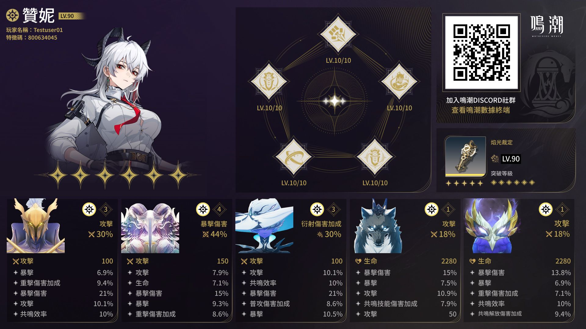
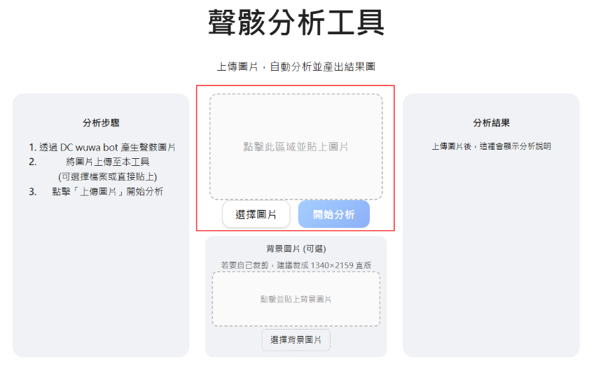
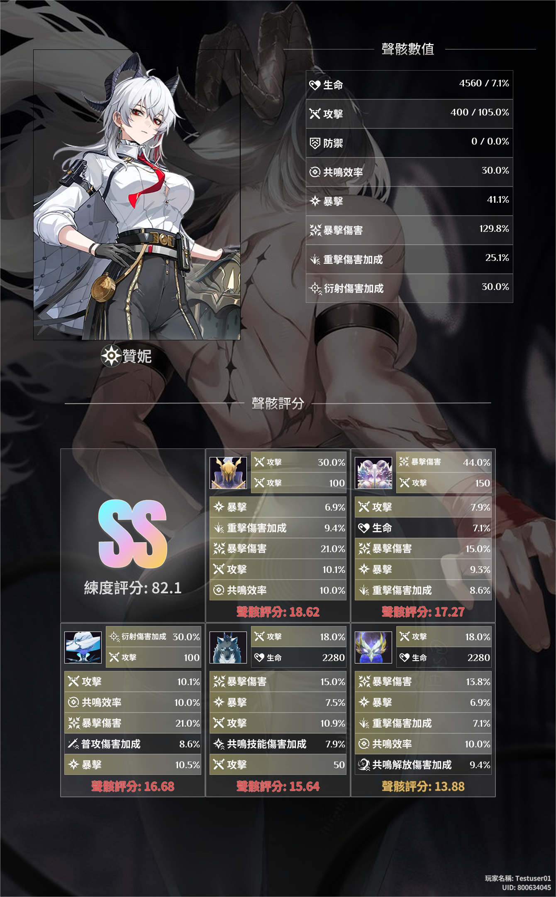

# 鳴潮角色聲骸分析工具

由於鳴潮並未提供遊戲內建的練度評分工具，因此這個專案油然而生，目的在於全自動快速地分析角色練度。

## ✨ Features

- 支援圖片輸入
- 自動化處理流程
- 視覺化結果輸出

> 可選: 自定義結果圖背景圖片
---

## 🖼 Input

使用鳴潮官方DC機器人產生角色聲骸圖，使用方式參考: [DC機器人製作個人角色卡](https://forum.gamer.com.tw/C.php?bsn=74934&snA=8077)。

  

---
## 🎬 Processing Demo
將圖片複製或上傳至框選區域，並按下開始分析。

  

---

## 📤 Output

分析工具最後會輸出最終結果圖其中包含:
- 聲骸總數值 (包含主詞條與副詞條)
- 角色評分與評級
- 各聲骸分數及有效詞條 (高亮顯示)

  

---